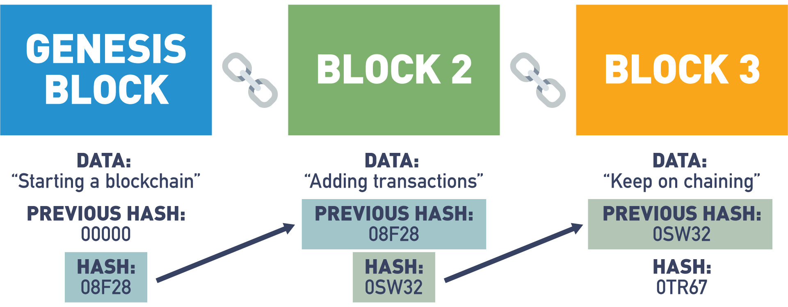
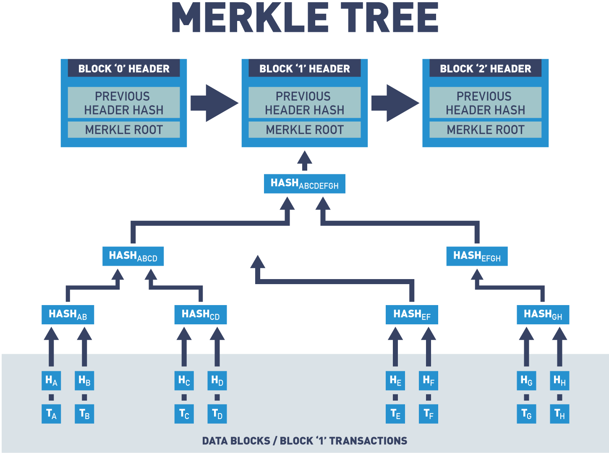

# Chapter 2. Blockchain Mechanics

## Contents
- [Chapter 2. Blockchain Mechanics](#chapter-2-blockchain-mechanics)
  - [Contents](#contents)
  - [Introduction](#introduction)
    - [1. Chapter Overview](#1-chapter-overview)
    - [2. Learning Objectives](#2-learning-objectives)
  - [Understanding Ledgers](#understanding-ledgers)
    - [3. Video: Introduction to Blockchain Components](#3-video-introduction-to-blockchain-components)
    - [4. Ledgers and Basic Accounting Systems](#4-ledgers-and-basic-accounting-systems)
    - [5. Video: Island of Yap](#5-video-island-of-yap)
    - [6. Yap](#6-yap)
    - [7. Video: The Evolution of Distributed Ledgers](#7-video-the-evolution-of-distributed-ledgers)
    - [8. Decentralized Ledger](#8-decentralized-ledger)
  - [Cryptography](#cryptography)
    - [9. Video: From Distributed Ledger to Cryptography](#9-video-from-distributed-ledger-to-cryptography)
    - [10. Video: Rose Greenhow](#10-video-rose-greenhow)
    - [11. Early Use of Cryptography: Caesar Cipher](#11-early-use-of-cryptography-caesar-cipher)
    - [12. Cryptography Key Terms](#12-cryptography-key-terms)
    - [13. Video: Cryptography Basics](#13-video-cryptography-basics)
    - [14. Cryptographic Functions](#14-cryptographic-functions)
    - [15. Video: Byzantine Fault Tolerance](#15-video-byzantine-fault-tolerance)
    - [16. Types of Cryptography in Blockchain](#16-types-of-cryptography-in-blockchain)
    - [17. Public Key Cryptography](#17-public-key-cryptography)
    - [18. Identity: RSA Public Key Cryptography](#18-identity-rsa-public-key-cryptography)
    - [19. Video: Private/Public Key Cryptography](#19-video-privatepublic-key-cryptography)
    - [20. Zero-Knowledge Proof (ZKP)](#20-zero-knowledge-proof-zkp)
    - [21. Video: Zero-Knowledge Proof (Cave Example)](#21-video-zero-knowledge-proof-cave-example)
    - [22. Hash Functions in Blockchain](#22-hash-functions-in-blockchain)
    - [23. Video: Cryptographic Hashing Demo](#23-video-cryptographic-hashing-demo)
    - [24. Merkle Tree](#24-merkle-tree)
    - [25. Video: Merkle Tree, Validation of Data](#25-video-merkle-tree-validation-of-data)
    - [26. Ethereum vs. Hyperledger Fabric](#26-ethereum-vs-hyperledger-fabric)
  - [Transparency and Immutability](#transparency-and-immutability)
  - [Knowledge Check](#knowledge-check)
  - [Summary](#summary)

## Introduction

### 1. Chapter Overview

In this chapter, we will discuss distributed ledger technology, some of its basic components and how it differs from previous ledger storage techniques. We will gain an understanding of how previous computer technologies like file sharing, data storage and cryptography are wrapped into the blockchain foundations. We will also see how hashing functions and Merkle tree data structures help us immutably store and prove facts without revealing all the details.

Next, we will learn how these blockchain techniques are fundamental in public-key cryptography where key pairs support privacy and authenticity by only exposing the public key while keeping the private key secure. We will examine how this agreed-upon, append-only distributed ledger guarantees transparency and immutability, where trust in the information contained in the ledger is a given.

### 2. Learning Objectives

By the end of this chapter, you should be able to:

- Discuss how cryptography allows for distributed ledgers to work on a global scale.
- Explain how blockchain is using cryptography.
- Define key terms of cryptography and understand basic concepts.
- Explain the concept of zero-knowledge proofs (ZKPs) and Merkle trees and how they are used in blockchain technologies.
- Discuss how blockchain utilizes transparency.
- Explain what it means for blockchains to be immutable and how chaining provides this capability.

## Understanding Ledgers

### 3. Video: Introduction to Blockchain Components

### 4. Ledgers and Basic Accounting Systems

### 5. Video: Island of Yap
### 6. Yap
### 7. Video: The Evolution of Distributed Ledgers
### 8. Decentralized Ledger
   - As we can see by looking at the evolution of the ledger, we are entering a new phase where no one centralized authority has control of the details in the ledger, everyone does. Transactions are only added to the ledger if everyone agrees. Once consensus is reached, no one can go back and deny a transaction. So essentially you are not trusting one person or entity to control the ledger, you're trusting everyone. Let's look a little further into how that trust is achieved.

## Cryptography

### 9. Video: From Distributed Ledger to Cryptography
   - A great way to think of blockchain is to think of blockchain as another layer of the Internet, a layer that enables secure and trusted records and transactions to occur, which is why a lot of people associate the word blockchain with the word trust. Blockchain creates a layer of trust between untrusted parties.
### 10. Video: Rose Greenhow
    - cryptography
    - while blockchain itself may be new and cutting-edge, it's built out of nothing more than very old tried-and-true technology.
    - we're just combining old technology in new and creative ways to create a brand new solutions development platform.
### 11. Early Use of Cryptography: Caesar Cipher
### 12. Cryptography Key Terms
      

### 13. Video: Cryptography Basics 
    - two big takeaways:
      - cryptography is normally a two-way function with four components: the secret, the key, the function, and the cipher
      - a subclass of cryptographic functions called cryptographic hash functions, which exist as one-way functions, which can only encrypt the secret,

### 14. Cryptographic Functions
   

### 15. Video: Byzantine Fault Tolerance

- Byzantine Generals Problem
   - the Byzantine Generals Problem explored a really key area of cryptography, in fact, **the heart of what cryptography is,
   - which is how do I exchange messages with someone in an environment where they may become corrupt.**

- Byzantine Fault Tolerance.
   - when you hear Byzantine Fault Tolerance, often abbreviated as BFT,
      - all we're talking about is this idea that blockchains become secure if they have more computing power, more hash power in the chain than off the chain.

   - Byzantine Fault Tolerance.
      - It is the root of cryptography, which is simply the study of how do we send information back and forth securely in the presence of adversaries and bad actors, 
      - and it's what underlies all the security and immutability that we get in blockchain.

### 16. Types of Cryptography in Blockchain

To understand cryptography in blockchain, you must be able to differentiate between various cryptographic techniques used. 

There are four main ways blockchain leverages cryptography:

- Public Key Cryptography
   - This encryption method uses a pair of keys: an encryption key, and a decryption key, named public key and private key, respectively. The key pair generated by this algorithm consists of a private key and a unique public key that is generated using the same algorithm.
- Zero-Knowledge Proofs
   - A new approach to protecting digital secrets that prove knowledge of a secret without revealing it.
- Hash Functions
   - This type of encryption doesn’t make use of keys. It uses a cipher to generate a hash value of a fixed length. The function converts plain text (no matter the size) into a hash of fixed size. It is nearly impossible for the contents of plain text to be recovered from the cipher text. Think of it like trying to recreate a human from a fingerprint, a fingerprint uniquely represents a human no matter the size of the human and you can’t reverse engineer a fingerprint to recreate the human.
- Merkle Trees
   - A data storage technique that compresses or packs data for storing blockchains with a tamper-free component built in. Merkle trees are built upon hashing principles in that each hash becomes a part of the next hash to build a tamper resistant data storage model.

### 17. Public Key Cryptography

Identity in the blockchain is based on public key cryptography. A person’s address on the blockchain is their public key.

Transactions on the blockchain include their public key and are digitally signed with the sender’s private key:

A digital signature verifies that someone in possession of the private key authorized the transaction.
Digital signatures can be easily verified using the corresponding public key, which is included in the transaction.

### 18. Identity: RSA Public Key Cryptography

- Identity: Specific Identity Implementations

   - Ethereum is a public blockchain that anyone can participate in. 
   - Hyperledger is an example of an enterprise blockchain where participants must be granted access to engage in the blockchain.

   - Ethereum
     - A user’s identity is an address based on their public key.
   - Hyperledger
      - Identity is managed by X.509 certificates. Certificates are only shared with parties involved in the transaction.

Public key cryptography uses a pair of a public key and a private key to perform different tasks. Public keys are widely distributed, while private keys are kept secret.

Using a person's public key, it is possible to encrypt a message so that only the person with the private key can decrypt and read it. Using a private key, a digital signature can be created so that anyone with the corresponding public key can verify that the message was created by the owner of the private key and was not modified since.

### 19. Video: Private/Public Key Cryptography

### 20. Zero-Knowledge Proof (ZKP)

Zero-knowledge proofs authenticate parties without the need to widely transmit private information online. A zero-knowledge proof (ZKP) is a cryptographic method that allows a party (the prover) to prove to another party (the verifier) that a given statement is true, without conveying any additional information.

Let's review an example. Let's say there are two toy cars, identical in shape and size, except, one is red and one is blue. Jerry, who is color-blind, holds the toy cars behind his back. Jerry then shows one of the cars to Sam. Jerry then hides that car behind his back and shows Sam the other car. Sam can consistently detect the switch because the cars are different colors, but he never has to reveal the color of the cars to Jerry in order to prove the secret.

### 21. Video: Zero-Knowledge Proof (Cave Example)

Zero-Knowledge Proofs are often referred to as zk-SNARKs, which stand for "Zero-Knowledge Succinct Non-Interactive Arguments of Knowledge", or zk-SNARKs for short.

For example, a user may make a request to send another user some money.
The blockchain naturally wants to make sure, before it commits this transaction,
that the user sending the money has enough to send.
However, the blockchain doesn't really need to know or care who is spending the money, or how much total money they have.
Being able to answer a question of "Does a user have enough money to send to another user" without knowing who the user is, or exactly how much they have,
is one of the primary use cases for Zero-Knowledge Proofs in blockchain.

### 22. Hash Functions in Blockchain

### 23. Video: Cryptographic Hashing Demo

### 24. Merkle Tree

### 25. Video: Merkle Tree, Validation of Data

- String vs Binary tree
   - The reason you wouldn't want to hash the entire set of data as a string is because it's not efficient when validating transactions.
   - String
     - In this example, if Alice needed to show Bob that this transaction was valid, let's say transaction "C", Alice would need to send the entire list of data to validate the block.
     - 
   - Binary tree
     - But when using a Merkle tree, Alice only needs to send the nodes that contain the transaction that she is looking to validate.
     - Let's say Alice wants to validate transaction "F".
        - Alice would only need to send the data of transaction "F" and four hash values to Bob.
        - Bob would then calculate the hash value based on the given information. And if the root matches the block, the transaction can be assumed to be valid.
        - 
- Merkle trees allow for validation of a specific transaction without requiring the entire set of data.

### 26. Ethereum vs. Hyperledger Fabric

## Transparency and Immutability

## Knowledge Check
## Summary