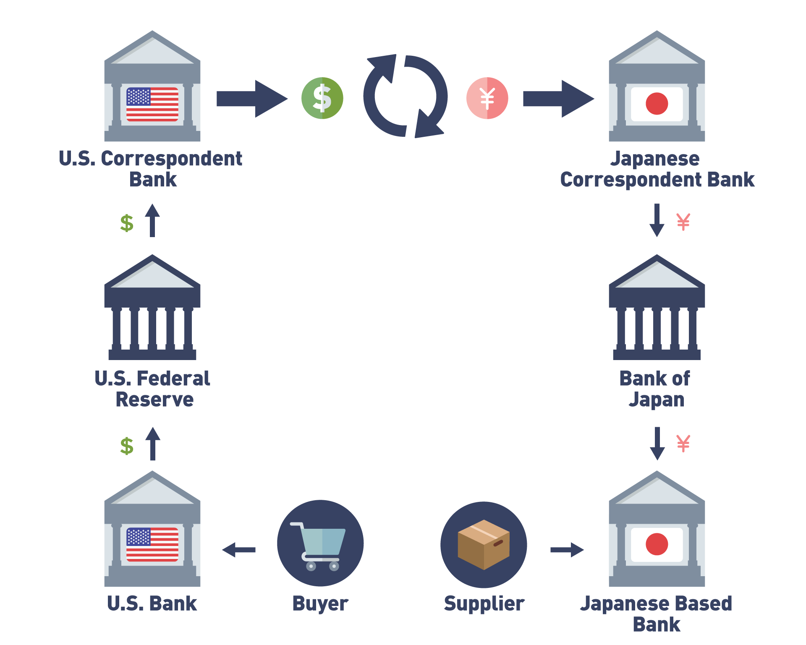
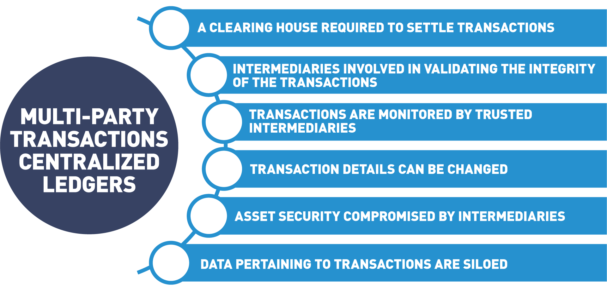
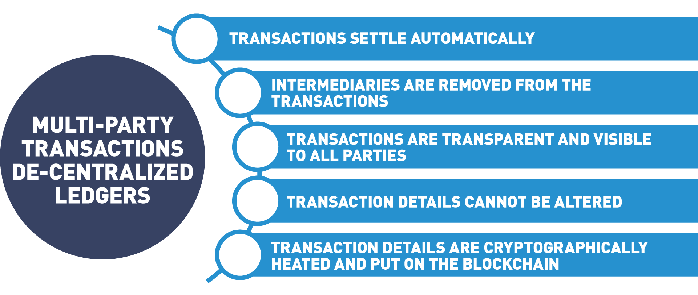

# Chapter 5. Blockchain Problem Solving and Future Trends

- [Chapter 5. Blockchain Problem Solving and Future Trends](#chapter-5-blockchain-problem-solving-and-future-trends)
- [A. Introduction](#a-introduction)
  - [1. Chapter Overview](#1-chapter-overview)
  - [2. Learning Objectives](#2-learning-objectives)
- [B. Problems Blockchain Solves](#b-problems-blockchain-solves)
- [B.1. Immutability](#b1-immutability)
  - [3. Immutability Defined](#3-immutability-defined)
  - [4. Video: Immutability](#4-video-immutability)
  - [5. Traditional Database Immutability Concept](#5-traditional-database-immutability-concept)
  - [6. Blockchain Immutability Concept](#6-blockchain-immutability-concept)
- [B.2. Transparency](#b2-transparency)
  - [7. Transparency Defined](#7-transparency-defined)
- [B.3. Append-Only](#b3-append-only)
  - [8. Traditional CRUD Explanation](#8-traditional-crud-explanation)
  - [9. Blockchain Append-Only](#9-blockchain-append-only)
- [B.4. Autonomy](#b4-autonomy)
  - [10. Autonomy Defined](#10-autonomy-defined)
  - [11. Autonomy: Human Process-Driven Complexity](#11-autonomy-human-process-driven-complexity)
  - [12. Autonomy with Smart Contracts](#12-autonomy-with-smart-contracts)
  - [13. Video: Smart Contracts](#13-video-smart-contracts)
  - [14. Multi-Party Transactions](#14-multi-party-transactions)
  - [15. Blockchain Multi-Party Sync (Removing Middlemen)](#15-blockchain-multi-party-sync-removing-middlemen)
  - [16. Cross Border Payments and Ledgers](#16-cross-border-payments-and-ledgers)
  - [17. Video: Double Spend](#17-video-double-spend)
  - [18. Blockchain Solves The Double Spend Problem](#18-blockchain-solves-the-double-spend-problem)
  - [19. Digital Currency Difficulties](#19-digital-currency-difficulties)
- [C. Digital Currencies](#c-digital-currencies)
  - [20. Digital Currencies Overview](#20-digital-currencies-overview)
  - [21. Cryptocurrency Defined](#21-cryptocurrency-defined)
  - [22. Cryptocurrencies Markets](#22-cryptocurrencies-markets)
- [D. Future Trends](#d-future-trends)
- [E. Knowledge Check](#e-knowledge-check)
- [F. Summary](#f-summary)

# A. Introduction

## 1. Chapter Overview

Now that we understand the basics of how blockchain works, Chapter 5 will discuss **the problems blockchain can solve**. We will discuss the concept of immutability and how the append only blockchain brings new trust in shared information. Next, we will take what we learned about smart contracts to see how they are bringing autonomy to systems that previously required human interaction. We will discuss the double-spend issue and how blockchain can solve for it. We will also discuss some popular cryptocurrencies.

Next, we will discuss the **new business trends** blockchain makes possible. First, we will discuss the way we manage our identity and information on the Internet and how decentralized identity solutions rooted on a blockchain are fixing what is broken. Next, we will discuss how blockchain is revolutionizing the financial markets by autonomous market solutions that remove middlemen and open markets up to previously excluded clients. We will also join in the conversation around Central Bank Digital currencies and how enacting blockchain solutions can streamline the government's monetary policies.

Finally, we will discuss the energized world of NFT’s (non-fungible tokens) and how owning unique rights to everything from music, sports collectables and even “captured moments” is turning the collectable world upside down. We end the chapter with a brief discussion on interoperability. In order for this new technology to take hold, blockchains need to be able to communicate and transfer value amongst themselves.

## 2. Learning Objectives

By the end of this chapter, you should be able to:

- Discuss immutability in blockchains.
- Explain what transparency is and review advantages and disadvantages of append-only ledgers.
- Explain how blockchain is looking to be autonomous through smart contracts.
- Discuss how blockchain removes third party intermediaries.
- Discuss how blockchain solves the problem of double spending.
- Distinguish between traditional database vs. blockchain immutability.
- Discuss central bank digital currencies and how they operate.
- Explain identity management on a blockchain.
- Discuss decentralized finance and the implications for the financial industry.
- Examine Central Bank Digital Currencies (CBDC).
- Discuss non-fungible tokens and how they will impact society.
- Examine the importance of interoperability for blockchains.

# B. Problems Blockchain Solves

# B.1. Immutability

## 3. Immutability Defined

Immutability is when something is unable to be changed.

## 4. Video: Immutability

- Immutable
  - As this data is stored in many different locations, changing or removing a copy of the data in one single place, or in a limited number of places poses no threat.
- record who  endorse or agree with

Imagine the new opportunities that arise when organizations can safely and securely share their most critical data with one another,
with the trust that the data they're seeing hasn't been compromised or altered.

## 5. Traditional Database Immutability Concept

- Central can override
  - if there is a central authority, they have all the ability in the world to override that feature.
- Immutability is not new
  - Another point to keep in mind is that immutability has been around for many years, just like the majority of the tech used via blockchain; it is the combination of these that makes it unique.

## 6. Blockchain Immutability Concept

- Review immutable
  - Let's review the aspects of the public blockchain that improve the chances of it being immutable.
- Consensus leads to immutable
  - There are many different variables, but the main one is consensus. In a blockchain, it refers to the logs of transactions which are created by consensus among the chain’s participants. The basic notion is that once a blockchain transaction has received a sufficient level of validation and posted on the chain, it can almost never be replaced, reversed or edited.
- Chance of overriding is 0
  - If all the nodes within the network (Bitcoin specifically) are working to solve a really hard math problem by running many computers simultaneously, the chances of anyone overriding that are slim to zero.

  - But, if someone wanted to undermine the immutability of the Bitcoin blockchain, here’s how they would do it:

    - First, they would install more mining capacity than the rest of the network put together, creating a so-called “51% attack”.
    - Second, instead of openly participating in the mining process, they would mine their own “secret branch", containing whichever transactions they approve and censoring the rest.
    - Finally, when the desired amount of time has passed, they would anonymously broadcast their secret branch to the network.

  - Since the attacker has more mining power than the rest of the network, their branch will contain more Proof of Work than the public one. Every Bitcoin node will therefore switch over since the rules of Bitcoin state that the more difficult branch wins. Any previously confirmed transactions not in the secret branch will be reversed and the Bitcoin they spent could be sent elsewhere. The computing power required to achieve this is enormous and probably only theoretical, but it’s important to consider.

- Example: DAO hack, Ethereum hard fork
  - One other less technical and malicious example would be from the Ethereum hard fork that directly happened after the DAO hack. In this example, the majority of the Ethereum nodes in the network decided to update the software preventing those hackers from withdrawing the cryptocurrency “earned” (stolen). This update could not be enforced, since every Ethereum user controls their own computer. Nonetheless, it was publicly supported by Vitalik Buterin, Ethereum’s founder, as well as many other community leaders. As a result, most users complied, and the blockchain with the new rules kept the name "Ethereum". A minority disagreed with the change and continued the blockchain according to its original rules, earning the title "Ethereum Classic".

# B.2. Transparency

## 7. Transparency Defined

Anything that is see-through, where there is very little fog or obstruction in the way. 

In the context of business/technology, this can be seen as a way of operating that is easy for others to see what actions are being performed.

# B.3. Append-Only

## 8. Traditional CRUD Explanation

- traditional DB
  - client
    - create, read, update, delete
    - In a traditional database, a client can perform four functions on data: create, read, update, delete. 
  - administrator
    - In a traditional database, there is usually an administrator, the authority giver who allows certain known participants in the database to do more than read/create; it allows them to update (change) and/or delete.

  - track  changes
    - Due to the fact that the administrator is controlling who has access and who doesn’t, it’s easier to track these changes and prevent actors from tampering. 
- public blockchain
  - In the public blockchain world, this isn’t necessarily the case.

## 9. Blockchain Append-Only

- full node is its own administrator
  - Within the public blockchain world, every full node on the network is its own administrator, where it can create (e.g. add) and read; this is also known as read/write access (e.g. append-only). These nodes only add more data over time in the form of blocks, but all previous data is permanently stored and cannot be altered.

    - Read: query (e.g. search) and retrieve data from the blockchain.
    - Write: add more data onto the blockchain.

["Blockchains vs. Traditional Databases" ](9.towardsdatascience.com-Blockchains%20versus%20Traditional%20Databases.pdf)

# B.4. Autonomy

## 10. Autonomy Defined

- Autonomy
  - Independence or freedom, the ability to make your own decisions without being controlled by anyone else. 
    - This sense of freedom can be at the macro level of a country or at the micro level of a person.
- matter
  - how much autonomy one truly wants and can handle.

## 11. Autonomy: Human Process-Driven Complexity

- intermediaries - complex
  - solve this complex
    - The blockchain world is looking to solve all of this complexity with autonomy from intermediaries via automated smart contracts. In the traditional world of doing any kind of transaction with another party, there tends to be a lot of administrative paperwork, with third parties intervening every step of the way. Some of this is needed, but most of it becomes wasted time and effort which could be spent elsewhere.
    - Depending on how complex a transaction is between two parties, designated specialists can make the process more efficient. Many players are involved in the process, from contract drafters, signatories, and regulators. If a dispute over the contract occurs, many parties can be involved, including the courts.

    - This complexity can be seen within many areas of life. Take a moment to dissect the backend of certain services or products you use and this concept will become exposed very quickly.

## 12. Autonomy with Smart Contracts

- Smart Contract for Autonomy
  - Autonomy in the blockchain world can be seen from many different angles. We are going to focus solely on smart contracts in this section, due to the amount of autonomy they provide everyone involved. 

  - An example of a smart contract could be,

    - "if this happens before the end of the year, then you pay me, else I pay you".

- smart contact need human/AI/Oracle
  - At the present moment, they can't make decisions without human intervention, or AI, which is a highly debated topic at the moment by many neuroscientists/philosophers. Companies are emerging as reliable Oracles that filter in real world facts to the blockchain. An Oracle is defined as a reliable source of information and blockchain makes that information immutable.

- 3 main attributes that can bring more autonomy to exchanging information between parties
  - Anyone is able to create their own smart contracts without a central authority giving the right to do so
  - These contracts are executed without too much human intervention, and 
  - they’re stored on blockchain technology which provides a sense of permanence. 
  
- smart contract benefits  
  - not only improving our autonomy as individuals or companies, 
  - but shifting wasted resources (middle men/women) toward more impactful work.

## 13. Video: Smart Contracts

- Blockchain 1.0 
  - capturing and recording data, but not acting upon it. 
  - Bitcoin
    - only record
- Blockchain 2.0
  - Ethereum 2015
    - capture data, act upon it as well.
      - implemented by the technology "Smart Contracts"
  - Smart Contract
    - a Smart Contract is some computer code deployed to a blockchain network. 
      - Users can transact with the Smart Contract just as they would another user, except when transacting with a Smart Contract, the rules defined in the code are used to process the transaction. 
    - This advancement now allows blockchain solutions to manage and automate processes, and record their results on a permanent, immutable, secure ledger shared with all relevant parties.

## 14. Multi-Party Transactions

- third party -- most efficient

  - In our current world of transactions, there’s always a third party to assist with connecting the sender and receiver. This has always been the most efficient way to move something from Point A to Point B. 

  - But with a third party making the connection comes the need to trust that they’ll get whatever is being sent in an efficient, economical, and effective way. This trust is open to human and process error. But we’ve discovered through experimentation that certain use cases could be automated via smart contracts.

- cross-border payments
  - One example is cross-border payments. Sending money from one country (border) to another country (different border). The major issue with how this is traditionally done today (e.g. correspondent banking) is that certain transactions end up stopping off at 7–10 different checkpoint banks. This constant stopping is making the money movement more expensive (each bank takes a fee), slower, and less reliable (sometimes it might never make it). This type of transaction is heavily reliant upon third parties to facilitate the movement of information and money.

## 15. Blockchain Multi-Party Sync (Removing Middlemen)

- Blockchain benefits: remove middle men
  - Blockchain technology has been shown to provide many benefits, but one of the most prominent and immediate benefits is removing middlemen (third parties) from a variety of processes. 
- middlemen already removed:
  - There is a long list of examples for middlemen currently being removed, such as:
    - Energy distributors
    - Payment networks (Visa and Mastercard)
    - Content distributors (YouTube, Facebook, Medium, etc.)
    - Central exchanges (NASDAQ, London Stock Exchange, NYSE, etc.)
    - Cloud database providers (AWS, Azure, etc.).
- Blockchain trust
  - How is the blockchain world removing this middleman? The answer is all around trust. Within the public blockchain world, where everyone is theoretically anonymous, there needs to be trust so we’re able to exchange valuable things without the concern of bad actors. Trust is built into the consensus mechanism that we’ve mentioned multiple times throughout this course. This incentivizes all the participants to help secure and validate good actions throughout the network. With that built-in "trustless" trust, we’re able to remove those middlemen that provide no additional value, plus it could potentially increase the efficiency based on which public blockchain is being used.

## 16. Cross Border Payments and Ledgers

- Traditional centralized ledger  -- changable, not safe
  - Traditional centralized ledger systems have weaknesses. Accuracy is dependent on intermediaries who can change details of the centralized ledger. Data derived from the ledger is siloed and misused.
    
- Distributed decentralized ledgers - immutable, secure
  - Distributed decentralized ledgers are not dependent on intermediaries who can manipulate the data. Data is secure and tamper resistant.
    

## 17. Video: Double Spend

Bitcoin was not the first attempt to create a digital currency, but it was the first which
was able to successfully solve a long-standing problem - the "Double Spend" problem.

## 18. Blockchain Solves The Double Spend Problem

Bitcoin was the **first** decentralized protocol to solve this problem and now more protocols are following, such as: 
- Proof of Stake (PoS), 
- Delegated Proof of Stake (DPoS), 
- Directed Acyclic Graphs (DAG) structures, 
- Proof of Authority (PoA), etc.

## 19. Digital Currency Difficulties

- to create digital cash, many failed due to a variety of reasons, such as:
  - adoption
  - security
  - fraud

- digital currency attempts:
  - DigiCash
    - 1983, when David Chaum introduced the idea of digital cash in a research paper 
    - 1992, he founded DigiCash, an electronic cash company, which eventually went bankrupt in 1998 due to adoption (buyout by another financial institution). 
    - Today, David is a leading pioneer of blockchain companies such as Elixxir and Praxxis to provide scalable digital sovereignty.

  - CyberCash in 1994 (failed after the Y2K bug of 2000).
  - E-gold in 1996 (sunk by continuous money laundering, hacking, and extortion).
  - Liberty Reserve in 2006 (shut down in 2013 due to this becoming a great hangout spot for cybercriminals).

# C. Digital Currencies

## 20. Digital Currencies Overview

- Digital currencies
  - Digital currencies are available only in the digital world and not in the physical world. 
- Digital currencies define
  - They can be defined as any currency, money, or money-like asset that is primarily managed, stored or exchanged on computer systems. 
- Examples of digital currencies include 
  - cryptocurrency, 
  - virtual currency and 
  - central bank digital currency.

## 21. Cryptocurrency Defined

According to Investopedia,

"A cryptocurrency, broadly defined, is currency that takes the form of tokens or “coins” and exists on a distributed and decentralized electronic ledger. While a large majority remain completely intangible, some cryptocurrencies have ventured into the physical world by building associations with companies offering traditional payment rails (credit cards and payment processors)".

[10 Important Cryptocurrencies Other Than Bitcoin](21.investopedia.com-10%20Important%20Cryptocurrencies%20Other%20Than%20Bitcoin.pdf)

## 22. Cryptocurrencies Markets 

To break down the crypto markets, let's start with some basic definitions.

- Crypto Wallet

  - A cryptocurrency wallet is an application on your computer or smart phone that connects you to a blockchain where you can trade cryptocurrencies. A Bitcoin wallet allows you to trade Bitcoin, an Ethereum wallet accommodates Ether. You can not send Bitcoin to the Ethereum blockchain, each cryptocurrency must transact on its own blockchain.

- Multi-currency Wallets
  - Some wallets allow you to hold multiple cryptocurrencies in the same application. In these wallets, each cryptocurrency will have its own balance. To initiate a transaction, the application will create a cryptographically secure address (specific for the particular blockchain). This address acts as your account number and lets you send and receive the cryptocurrency.

- Atomic Swaps
  - Additional features in these wallets lets you “swap” one cryptocurrency for another. The application provider acts as the intermediary to secure the transactions from one chain to the other.

- Metamask

  - Metamask is a cryptocurrency wallet used to interact with the Ethereum blockchain and other blockchains issued in accordance with the Ethereum Platform. Tokens issued in accordance with the ERC-20 standard for utility tokens can be stored in a metamask wallet. Metamask not only stores cryptocurrencies but acts as a gateway to blockchain applications. You can access the wallet through a mobile application or a browser extension.

- ConsenSys
  - ConsenSys, spearheaded by Joe Lubin, an early Ethereum programmer, is a software engineering company that helps developers build next-generation networks and enable enterprises to launch more powerful financial infrastructure. Consensys Mesh is a playground for entrepreneurs and programmers to build decentralized platforms and projects, Metamask is just one project to come out of the efforts at Consensys.

- CryptoKittes
  - One example of how the Metamask wallet is used is with the CryptoKittes project. CryptoKitties are one of the first examples of a digital collectible where you own the rights (private keys) to code that represents a unique kitten. A kitten is a set of identifiers built or “bred” by a smart contract to be one of a kind. In order to purchase, view or interact with a digital kitten you must open your Metamask wallet and connect it to the cryptokitties.co website.
  - Kittens purchased on the cryptokitties.co site will be stored in the Metamask wallet associated with your account or can be put up for sale at an NFT marketplace. Any fees or revenue from your kittens will automatically be reflected in your Metamask wallet totals. Cryptokitties are the first example of a non-fungible token which we will cover in the next section.

- Exchanges

  - Cryptocurrency exchanges vary in complexities and user experience.

- Beginners
  - To start off, it is advantageous to deal with a centralized solution to store your cryptocurrency. These larger exchanges act as a bank for your cryptocurrencies. Offering features like loans and staking rewards (rewards for being an active part in a network).They vet the currencies they allow you to trade and store, while controlling the private keys for you, so accessing your currencies is as easy as a username and password. Such examples of these organizations are Coinbase and Gemini. Below you can see a screenshot of the Gemini Custodial Crypto Account Dashboard:
  - 

- Advanced
  - In keeping with the decentralization nature of the cryptocurrency markets, exchanges exist where you are the custodian of your accounts and trading is done from your computer or smartphone. This is where the term Decentralized Finance was born. It gives you the ability to apply smart contracts to govern your trades and access to markets previously only for accredited investors. Such examples of decentralized exchanges are Liquid, SushiSwap and Uniswap. Below is the screenshot of the Liquid Exchange:
  - 
- Hardware Wallets

  - Hardware wallets offer an alternative to storing your cryptocurrency online. These devices plug into a USB port and transfer your private keys (ownership rights to the cryptocurrency) from your “hot wallet” (mobile, computer or web based) to be stored offline. If the device is damaged or lost, so are the cryptocurrencies stored. This is what the ledger wallet looks like:

# D. Future Trends

# E. Knowledge Check

# F. Summary