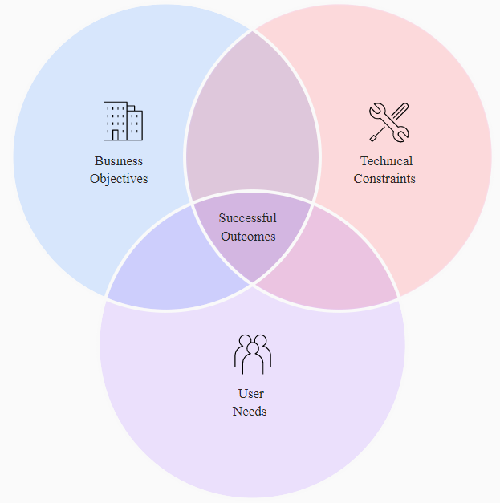
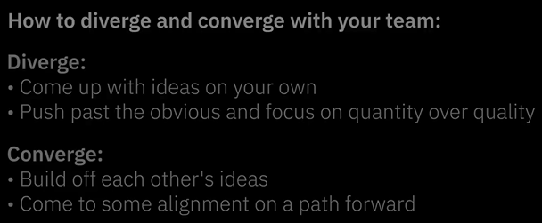

# Enterprise Design Thinking Framework by IBM

# 1. The Enterprise Design Thinking Framework

What is design thinking?
- a human-centered, iterative method for problem solving

Who can use design thinking?
- Anyone

What makes Enterprise Design Thinking different?
- it’s more effective for enterprise teams and their problems

Take a minute to explore the vocabulary of Enterprise Design Thinking.

## The Principles

The Principles guide your day-to-day work. They ensure you’re keeping your user in mind, collaborating with a diverse team, and continuously trying to improve your solutions.

- A focus on user outcomes
  - Drive business by helping users achieve their goals.
- Restless reinvention
  - Stay essential by treating everything as a prototype.
- Diverse Empowered Teams
  - Move faster by working together and embracing diversity.

## The Loop

Understand the present and envision the future in a continuous cycle of observing, reflecting, and making.

- Observe
  - Immerse yourself in the real world with design research. Interview users, watch them work, and test your ideas with the people who matter most to inform your decision-making and understanding.
- Reflect
  - Come together and look within to synchronize your movements, synthesize what you’ve learned, and share your “aha” moments with each other. Decide together and move forward with confidence.
- Make
  - Give concrete form to abstract ideas. The earlier you make the faster you learn. Put your ideas out there before they’re complete and improve them as you go.

## The Keys
Scalable practices for enterprise team alignment

- Hills
  - Align your team around the meaningful user outcomes you want to achieve. Hills are statements of intent written as user enablements. They follow a format of Who, What, and Wow.
    - Who: Who is your user? Refer to them by name.
    - What: What will your user be able to do that they couldn’t before? Start with a verb and avoid solutions.
    - Wow: What differentiates you from the competition? This is measurable.
- Playbacks
  - Stay aligned by regularly exchanging feedback. Playbacks are story-based presentations that share insights, ideas, and updates to a user experience.
- Sponsor Users
  - Invite users into the work and stay true to real-world needs. Sponsor Users are external clients, future clients, or end users that represent your target user, who regularly contribute domain expertise to your team. Relationships with Sponsor Users are typically formalized with an agreement that covers confidentiality and our right to use their feedback.

## Files
- Design thinking [poster](EDT_poster.pdf) and [wallpaper](EDT_wallpaper.jpg).
- [Introduction Summary](introduction-summary.pdf)

# 2 What is important - A focus on user outcomes

## 1. Identify your users and their problems
When you focus your team and your work around your users and their needs, you’re able to more easily decide what’s important. This makes your offerings more essential to the people who use them. If all you did was ask:

- Who are our users?

- What is their current experience?

- How could it be improved?

over and over again, you would get closer and closer to understanding your users and creating an ideal future for them. This allows you to put a more valuable offering into your client’s hands and into the market.

## Business problems to human-centered problems

## 2. Recongnize your assumptions
Get first hand data, feelings about your users

Observe to learn more
- Dig deeper than a requirement list. Remember: We’re not here to design a “vase.” We’re here to understand someone’s wants and needs, worries and goals, contexts and constraints. Building empathy for users and uncovering their needs will always get you much closer to solving business problems than blindly improving your product or service.

[Summary - A focus on user 
outcomes](a-focus-on-user-outcomes-summary.pdf)

# 3. Restless reinvention 

## Bias toward action
- View everything as a prototype
- Give form to ideas
  - Everything starts as an idea, but you can’t learn much about an idea without giving it some form.
  - **Visualize your ideas**, so that your team and users can understand them clearly. Making doesn’t have to be intricate. It can be as simple as a sketch on a napkin—but it does need to communicate the idea enough for someone else to understand it and give you feedback.
- Low stakes, big reward
  - iterate
- Try it today
  - The next time you have a new idea to share with your team, before you tell them about it, draw it on paper. Think about how a diagram or visual representation might convey something that words couldn’t. After all, a picture’s worth 1,000 words.

## Actively seek great ideas
- Quantity over quality
  - The most brilliant ideas are found among a multitude of ideas. Don’t limit your brainstorming. Your first few ideas are going to be really obvious, so get them out onto paper first to make room for your more interesting ideas to flow. Don’t stop until you’ve come up with as many as possible, even if you think you have “the answer.”

- Stretch your thinking
  - ideating
    - the practice of coming up with new ideas
  - Ideas are everywhere. You have them everyday. And while there are no bad ideas, some ideas are better than others. Ideating takes practice. Your brain is a muscle (not really, but let’s pretend) that is really good at doing the things it’s done over and over again, but it needs to stretch and strengthen in new ways in order to do new things. 
 
- “If at first, the idea is not absurd, then there is no hope for it.” - Albert Einstein
  - Over the course of time, ideas ebb and flow. They’ll start as boring and move between absurd and brilliant. The more absurd the idea, the more likely it will spawn a brilliant one. So when ideating gets stale or hard, try a strange or silly prompt.

## Take risks

- Failing as opportunity
  - Design thinking works in the same way. As you fail quickly and cheaply, you get closer and closer to the best solutions. In fact, if you’re not failing, you’re probably not doing anything interesting. When you recognize that it’s okay to be wrong, you open yourself up to new possibilities and better ideas.
  - fail fask and cheap. fail early.

[restless-reinvention-summary](restless-reinvention-summarypdf.pdf)

# 4. Diverse empowered Team

## Include a variety of voices

Diverse teams have varied perspectives, skills, and backgrounds. They build upon each other’s ideas, enrich each other’s knowledge, and challenge each other’s assumptions in ways that accelerate the work.

Empowered teams have the agency to make everyday operational decisions on their own. They’re equipped with the expertise and authority to deliver outcomes.

Diverse Empowered Teams
an Enterprise Design Thinking Principle that represents that a group of people with varied perspectives more successfully make decisions together and work toward shared goals

Collaboration in Action:

## Build alignment across your team

1. Overcome diversity pitfalls
While inclusion of many voices builds strong ideas, it also increases chances of misunderstanding and conflict. These pitfalls can be detrimental if they aren’t addressed properly. Diverse teams are most successful when they can bring their different viewpoints together and find alignment.

2. Identify if you’re aligned

Sometimes you assume you’re aligned when you’re not. Teams break out into solo work and end up duplicating efforts, or delivering things that aren’t useful.

Alternatively, teams might belabor a conversation when an agreement has already been reached, and get stuck spinning in circles. In order to break free from these business-as-usual problems, you first must recognize them.

3. Try it today
How’s your work calendar looking? Full of meetings? Many meetings lack productive outcomes. Maybe you’ve been there: an hour of talking ends in the same place it started or a contentious 30 minutes leaves everyone feeling frustrated. Instead, take these as opportunities to start aligning your team.

Next time you’re in a meeting where the conversation spins in circles, ask everyone to grab something to write with, visualize their thoughts, and then take turns sharing.

Next time you’re in a meeting where only one or two people share their opinion, hold a silent and anonymous voting session to expose everyone’s viewpoints.

## Start sharing stories

One way to drive healthy collaboration and alignment amongst your diverse team is through **storytelling**. Good storytelling is the reason kids remember Luke Skywalker and Elsa, but forget what they did after school yesterday. The same rules apply to your work. Playbacks are opportunities to tell memorable, human-centered stories that share ideas, prototypes, strategies, and more.

Playbacks
- an Enterprise Design Thinking Key, story-based presentations that bring stakeholders and whole teams together in a safe space to exchange feedback

## Build Playbacks into your workflow
There are a few specific moments where everyone on the team needs to be aligned:

1. Starting a new project or initiative. Answer questions like: Who will be the users and stakeholders? What experience are we trying to improve and why?
2. Deciding as a team on a future experience for your users. Answer questions like: What do we think our users need to be successful? How are we going to serve those needs?

2. Reviewing progress as you deliver. Answer questions like: Do we successfully deliver value to our users? Are we still aligned as a team?

Teams who share their goals by talking about a user and their needs, and invite feedback along the way, are more likely to understand and deliver on those goals together over time.

## Different Types of Playbacks

See how different Playbacks look and feel depending on your desired outcome—from quick and casual to formal and prepared.

[diverse-empowered-teams-summary](diverse-empowered-teams-summary.pdf)

# 5. Make a plan

## Define your problem
Your first step to practicing Enterprise Design Thinking is to refocus your work as a user-centered problem.

“A problem well-stated is a problem half-solved.” - Charles F. Kettering

Put another way, the first step to answering the question is knowing what questions to ask. In design thinking, to solve for an actual need that exists in the world, you must take the time to write clear problem statements around your intent: What problem are you solving, for whom, and why?

## Problem statements
Problem statements help us answer the question: “Where do we start?”

They put the user front and center, and align everyone around a clear issue to solve. However, they don’t dictate implementation or a specific solution. Problem statements are often the seeds of Hills.

Here’s one formula for problem statements:
- Our users struggle to achieve some task today because blockers, limitations, etc.

Hills
- a Key of Enterprise Design Thinking, a human-focused mission statement that describes a future enablement for a specific user

## How To Write A Great Problem Statement?

## Use the Principles
- A focus on user outcomes: Problem statements should always include a user and their current problem—not yours.

- Restless reinvention: Problem statements should be flexible and iterative as you learn more about your users and their current state.

- Diverse Empowered Teams: Problem statements should be written with all members of your team who bring relevant expertise.

[make-a-plan-summary](make-a-plan-summary.pdf)

