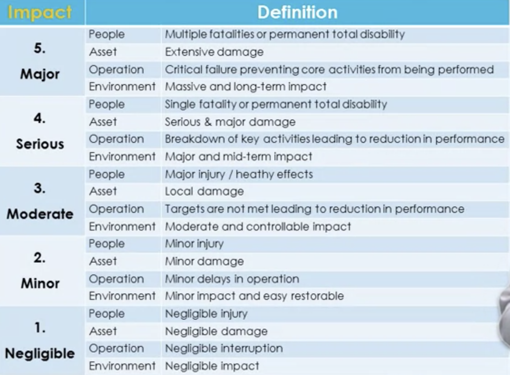
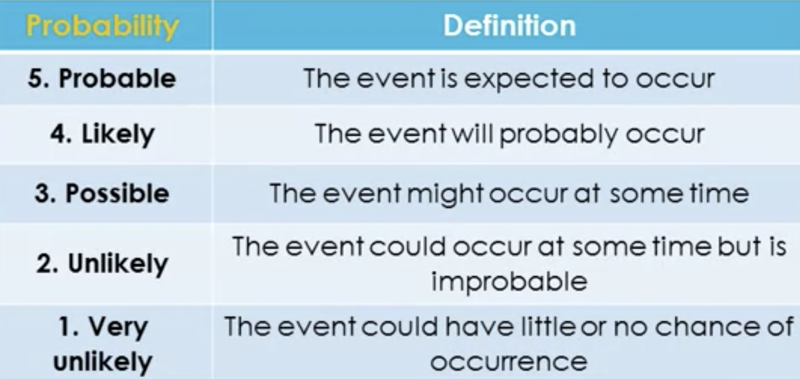
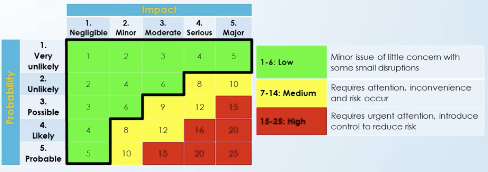
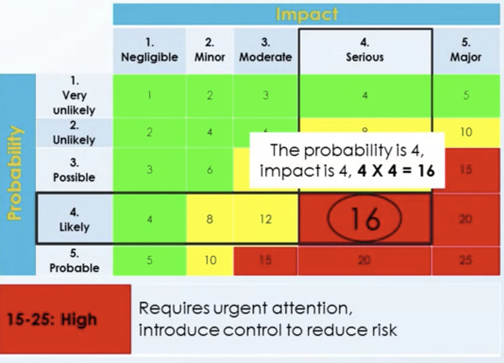
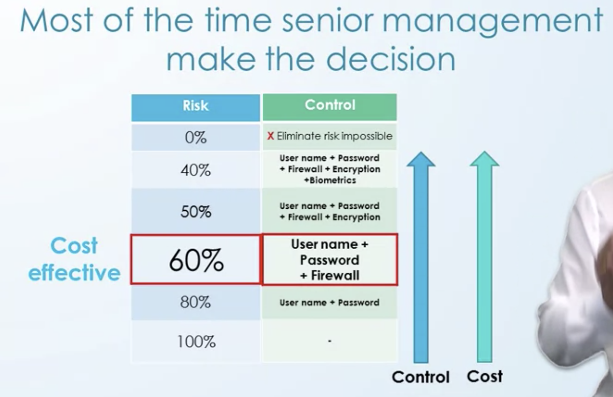

# Week 1 Introduction to Information System (IS) Auditing

- [Week 1 Introduction to Information System (IS) Auditing](#week-1-introduction-to-information-system-is-auditing)
- [1. Overview and Practitioner's Sharing](#1-overview-and-practitioners-sharing)
  - [1.1 Course overview](#11-course-overview)
  - [1.2 Career Prospect of IS Auditors](#12-career-prospect-of-is-auditors)
- [2. Risk in Information Systems (IS)](#2-risk-in-information-systems-is)
  - [2.1 Introduction to Risk in Information System](#21-introduction-to-risk-in-information-system)
  - [2.2 Recent news of risks related to Information Systems](#22-recent-news-of-risks-related-to-information-systems)
  - [2.3 Risk Management Process 1- Risk Assessment](#23-risk-management-process-1--risk-assessment)
  - [2.4 Risk Management Process 2- Risk Mitigation](#24-risk-management-process-2--risk-mitigation)
  - [2.5 Risk Management Process 3- Risk Re-evaluation](#25-risk-management-process-3--risk-re-evaluation)
- [3. Internal Controls of Information Systems (IS)](#3-internal-controls-of-information-systems-is)
  - [3.1 Identify Internal Controls](#31-identify-internal-controls)
  - [3.2 Internal Controls Examples](#32-internal-controls-examples)
- [4. Module 1 Quiz](#4-module-1-quiz)

# 1. Overview and Practitioner's Sharing

## 1.1 Course overview

- Risks and Controls
  - the most important keywords in Information Systems Auditing,
- IS Audit procedures
- how to embed controls into your information systems
  - systems development life cycle  
  - how the controls can be implemented in the information system itself. 
- Change Management
  - Finally, things keep changing. We have to add new modules to the systems. We have to correct problems with your information systems, we call it Change Management. 

## 1.2 Career Prospect of IS Auditors

- Receive basic training of basic information system risk and control
- Enhance business konwledge for better communication with clients
- Career Paths of IS auditors
  - entry level -> senior level -> manager level -> associate director -> partner (big four)
  - head of IT audit -> chief auditor

# 2. Risk in Information Systems (IS)

## 2.1 Introduction to Risk in Information System

- What is risk?
  - possibility of having negative impact
- WHy do we take risk?
  - Thinking of having postitive impact
    - e.g. stocks going up
- 3 elements of risk
  - threats
    - Natural disasters
    - Man-made threats
      - Internal (e.g. Fraud)
        - Who can give you highest damage? - Internal
          - Examples of Risk in Information System
            - [Google's Gmail and Drive suffer global outages](https://www.cnet.com/tech/services-and-software/gmail-is-down-outage-around-the-world-for-some-users/)
            - [Capital One Data Breach Compromises Data of Over 100 Million](https://www.nytimes.com/2019/07/29/business/capital-one-data-breach-hacked.html)
            - [Cathay Pacific sells first-class tickets from Portugal to Hong Kong at one-tenth of original price](https://www.scmp.com/news/hong-kong/hong-kong-economy/article/2181853/cathay-pacific-sells-first-class-ticket-portugal) 
      - External (e.g. Hacking)
    - Technical (e.g. hardware failure, software failure, network down, data)
  - impact
    - Measure of Impact
      - sometimes you can easily measure in terms of dollars
      - not all situations we can put a dollar amount to measure the impact
        - we call it "qualitative measures"
          - lost customers
          - customers'organization's reputation
          - customers'/employees' morale
          - customers' satification 
        - how to measure?
          - scale/levels
              - 5 Major
              - 4 Serious
              - 3 Moderate
              - 2 Minor
              - 1 Negligble
  - possibilities 
    - Likelihood of having risk
      - levels
        - 5 Probable
        - 4 Likely
        - 3 Passible
        - 2 Unlikely
        - 1 Very Unlikely
    - This is indirec measure. It could be subjective.

## 2.2 Recent news of risks related to Information Systems
1. Google recovers from outage that took down YouTube, Gmail, and Snapchat (Jun 2019)

    https://www.theverge.com/2019/6/2/18649635/youtube-snapchat-down-outage  

2. Unsecured Facebook Databases Leak Data Of 419 Million Users (Sep 2019)

    https://www.forbes.com/sites/daveywinder/2019/09/05/facebook-security-snafu-exposes-419-million-user-phone-numbers/#18a045b71ab7  

3. AWS servers hit by sustained DDoS attack (Oct 2019)

    https://www.cloudpro.co.uk/cloud-essentials/public-cloud/8276/aws-servers-hit-by-sustained-ddos-attack  

4. Reports says workers are biggest data security threat (Oct 2019)

    http://www.startribune.com/insiders-drive-most-cyber-security-breaches-according-to-study-for-minnesota-s-code42/562174112/  

## 2.3 Risk Management Process 1- Risk Assessment

- Process of risk management
  - risk assessment
  - risk mitigation 
  - risk re-evaluation
- Risk Assessment
  - Identify area of having high risk 
  - Step 1 Define the impact
    - 
  - Step 2 Define the probability of having risk (e.g. based on historical data)
    - 
  - Step 3 Identify the risk for different threats & create the risk matrix
    - 
- Risk Assessment example
  - Risk to your organization
    - What is the threat?
      - Cyber hacking to online server
    - What is the impact?
    - Step 1 Define the impact
      - 
    - Step 2 Define the probability 
      - 
    - Step 3 & 4 Create the risk matrix & rate the risk
      - 
      - It's high risk, needs urgent attention. 
      - We should not continue our business in this high risk area. 
      - What we should do now is to 
        - come up with ways to reduce the risk. Go to at least the yellow area, or possibly to green area. 
      - How can we do that? 
        - What we need to do is, reduce the risk, and the way to reduce risk is using controls. 
      - How do we use controls
        - risk mitigation

## 2.4 Risk Management Process 2- Risk Mitigation

- Risk Mitigation
  - reduce the risks using controls
  - 1 reduce the risk using control to a level acceptable by senior management
  - 2 transger the risk to third party
  - 3 avoid the risk (cannot elimante the risk)
- Risk Mitigation example
  - How can we reduce the risk of cyber hacking?
    - Current example that we're going to think about is, you keep your confidential information in your server, and it's connected to internet. Anyone has access.
    - 
    - Who make the decision?
      - To which level? Who decide it? Answer is, that decision is made by the senior management, because if something goes wrong within the organization, they have to have ultimate responsibility. 
    - try to balance between cost and benefit, the cost and the risk.
  - What are the options if senior management still not happy with the existing risk?
    - Transfer the remaining risk to third party
      - e.g. buy insurance
  - last option - avoid the risk
    - Eliminate the risk means we still go for e-banking and we come up with many many controls and decide, we don't have risks at all. That's eliminating. 
    - But avoid the risk means, no, we don't do e-banking, but we do traditional banking only.
    - Lose customers

## 2.5 Risk Management Process 3- Risk Re-evaluation

- What it is?
  - we go back to risk assessment and risk mitigation, we go back to do the step number one and then do the step number two again
- When should we do risk re-evaluation?
  - Two diff scenarios
    - Timve driven
      - do periodically (e.g. every 6 months)
    - Event driven
      - when there is environment change
        - e.g. 
          - sth changed within organization or similar organization
          - government regulation
          - natural disaster

# 3. Internal Controls of Information Systems (IS)

## 3.1 Identify Internal Controls
- Redduce risks using controls

- What are internal controls
  - Policies, procedures, or practices and organization structures implemented to reduce risks

- Example of internal control
  - Policy & Procedure
    - The senior management within the organization comes with the policies and procedures. Those policies and procedures would be implemented by the IT people as controls.
    - For example Every employees must change their passwords every 3 months
      - How to implement the policy
        - How was it controlled? How it was implemented?
          - IT people might send an email to all the employees to change
          - The way of implementing is that, if you don't change your username and password once in three months time, your account is going to be freezed. 
  - Law & regulations from government
    - For example
      - At the authorities level, government organizations level, they think that financial industry, has to make a reasonable effort to protect the client or client's data. In that sense, they might come up with the controls. They might come up with the policies and procedures. 

- 3 types of controls and examples
  - 1 Preventative controls
    - e.g.  if you have antivirus software installed in your computer, whenever there could be some virus attacks to your computer, your antivirus software is going to prevent that attack.
  - 2 Detective controls
    - e.g. sometimes the security administrators keep firewalls, that firewalls could detect any of these unauthorized access to the system and would give alarm to the security administrators.
  - 3 Corrective controls
    - e.g. back up data
      -  back up data. Because we have back up the data, we can do the restoration. That means correct whatever that we lose it. 
- Example - fire
  - to reduce risk of fire using control
    - list  15 controls to reduce the risk of fire
    - which control should be implemented before others?
      - precentative controls before detective
        - because we want to prevent whatever happen
      - firstly prevent as much as possible
      - then detective controls as soon as possible
      - finally corrective controls
      - Which one should come first in preventative controls? 
        - Reduce the probability should come before reduce the impact.
    - No. 9 and 10 should come first
      - reduce probability
      - reduce impact

|Reduce risk of fire 	|Ways of control	|Classification of controls |Order|
|-|-|-|-|
|1	|Install fire alarms	|Detective controls|
|2	|Use fire proof building materials	|Preventative, reduce the impact|
|3	|Install sprinklers	|Preventative, reduce the impact|
|4	|Fire drill practices	|Preventative, reduce the impact|
|5	|Install smoke detection sensors	|Detective|
|6	|Install escape route maps	|Preventative, reduce the impact|
|7	|Organize fire safety education workshops	|Preventative, reduce the impact|
|8	|Install fire extinguishers	|Preventative (it prevent the impact)|
|9	|No naked flame in the building	|Preventative|Should come first. Reduce the probability|
|10|	No smoking in the building	|Preventative|Should come first. Reduce the probability|
|11|	Backup system	|Corrective|
|12|	Regular maintenance of devices	|Preventative, reduce the impact|
|13|	Regular fire department inspection	|Preventative, reduce the impact|
|14|	Get fire insurance	|Corrective|
|15|	Install CCTVs	|Detective|
||

## 3.2 Internal Controls Examples

- how to identify the internal controls
- 3 steps
  - step 1 classify which control is primary
    - preventative, detective, corrective controls
  - step 2 explain how and what risks do the control address
  - step 3 analyze whether different controls can be applied in different situation

- example 1 - encryption software

# 4. Module 1 Quiz